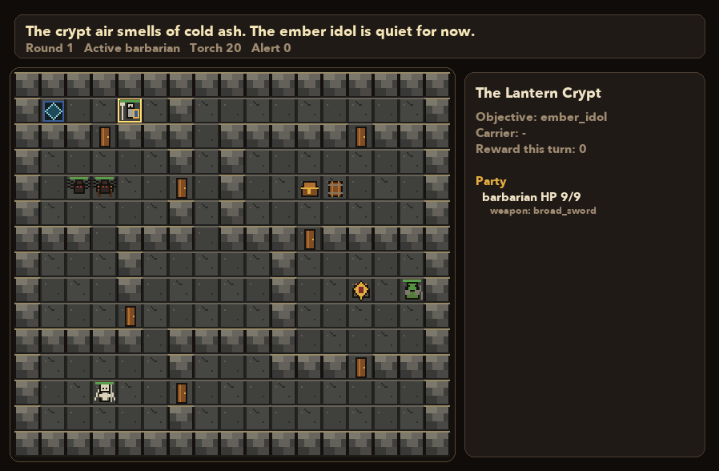
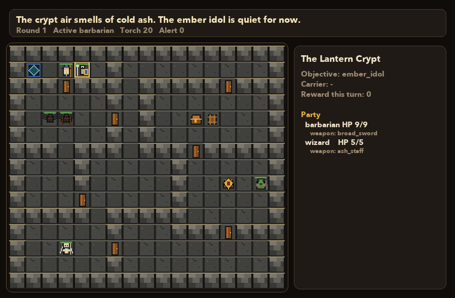

# DungeonGrid

DungeonGrid is a multi-agent benchmark for LLMs.





## OpenEnv ReAct Example

Agents receive compact text state, may query rule details, and submit structured JSON action plans. Public observations do not expose legal actions; DungeonGrid validates proposed actions, skips invalid queued actions, and reports concrete feedback in later observations.

```python
from dungeongrid import DungeonGridEnvironment, dungeongrid_rules

env = DungeonGridEnvironment()
obs = env.reset(quest_id="lantern_crypt", num_heroes=2, seed=1)

print(obs.text)
print(dungeongrid_rules("movement"))

result = env.act_plan(
    intent="Scout east, then tell the party what changed.",
    actions=[
        {"type": "move", "direction": "east"},
        {
            "type": "message",
            "target": "party",
            "payload": {"text": "I am checking the east passage."},
        },
    ],
)

print(result.executed_actions)
print(result.skipped_actions)
print(result.observation.text)
```

Classic dungeon-crawl dynamics are available as an opt-in benchmark mode:

```python
obs = env.reset(
    quest_id="lantern_crypt",
    num_heroes=2,
    seed=1,
    ruleset="classic_dynamic",
)
```

Tool-call shape:

```json
{
  "name": "dungeongrid_act",
  "arguments": {
    "intent": "Open the east door and stop if a room is revealed.",
    "actions": [
      {"type": "open_door", "target": "door_1"},
      {"type": "move", "direction": "east"}
    ]
  }
}
```

Reveal boundaries stop queued execution so the agent can replan after meaningful new board state appears: opened doors, revealed traps, opened chests, objective changes, turn end, or episode end.

## Checkpoint And Resume

DungeonGrid checkpoints are true environment snapshots: hidden state, public state, trace, turn state, and RNG state are preserved. Container checkpoints wrap that env snapshot in an agent+env envelope so policy state, rollout cursor state, and cumulative reward can be restored together.

```python
from dungeongrid import DungeonGridEnvironment

env = DungeonGridEnvironment()
env.reset(quest_id="lantern_crypt", num_heroes=4, seed=11)
env.act_plan([{"type": "move", "direction": "east"}])

env.save_checkpoint("lantern_crypt.ckpt", metadata={"label": "after_first_move"})

restored = DungeonGridEnvironment.load_checkpoint("lantern_crypt.ckpt")
restored.act_plan([{"type": "end_turn"}])
```

The container runtime exposes the same snapshot through checkpoint descriptors. `checkpoint_data_base64` can be passed to a fresh runtime process to resume or branch a rollout. For durable local services, instantiate the container runtime with `store_path="dungeongrid.sqlite"`; checkpoint descriptors and blobs will be indexed in SQLite and can be resumed by checkpoint id after process restart.

Container rollouts support blocking and async modes. Use `submission_mode="async"` to queue a rollout and poll `get_execution()`, or call `submit_rollout_batch([...], max_parallel=10)` to run benchmark slices concurrently with `asyncio.gather`.

## Dungeons

Bundled dungeons use a folder-per-dungeon schema:

```text
dungeons/<dungeon_id>/
  quest.json
  hooks.py
```

`quest.json` defines the map, rooms, objective, decks, furniture, monsters, bosses, scripts, and achievements. `hooks.py` is optional Python for bespoke trigger/effect behavior.

The bundled base expansion also exposes each dungeon family at four size tiers:

```text
base:<family>:pico    # 1 hero
base:<family>:lite    # 2 heroes
base:<family>:medium  # 3 heroes
base:<family>:heavy   # 4 heroes
```

Legacy family IDs auto-select a tier by party size during `reset`, so `quest_id="lantern_crypt", num_heroes=1` runs `base:lantern_crypt:pico`, while `num_heroes=4` runs `base:lantern_crypt:heavy`. Legacy `_lite` IDs resolve to the `lite` tier.

### External Expansions

Private or local expansion packs can be mounted without adding their content to
the public package. Set `DUNGEONGRID_EXPANSION_PATHS` to one or more
`os.pathsep`-separated directories. Each path may be either an expansion root or
a parent containing expansion roots:

```text
<namespace>/
  manifest.json or expansion.json  # optional; id/namespace overrides folder name
  dungeons/<family>/<tier>/quest.json
```

`missions/<mission>/<tier>/quest.json` is also supported. Mounted expansions use
the same public ID shape as bundled tiers:

```text
<namespace>:<family>:pico|lite|medium|heavy
<namespace>:<family>  # auto-selects tier by party size
```

For Python callers, pass `expansion_paths=[...]` to `DungeonGridEnvironment`.

## Benchmark Protocol

DungeonGrid includes default AP-mode suites plus the opt-in `classic_dynamic` suite:

| Suite | Quests | Rules | Notes |
|---|---|---|---|
| `DG-Solo-20` | 20 full dungeons | default AP mode | one hero, no specialist hard gates |
| `DG-Coop-20` | 20 full dungeons | default AP mode | two to four heroes |
| `DG-Lite-20` | 20 lite diagnostics | default or `classic_dynamic` | short MARL probes |
| `DG-Tiered-80` | 20 families x pico/lite/medium/heavy | default or `classic_dynamic` | explicit size-tier probes |
| `DG-ClassicDynamic-20` | 20 full dungeons | `ruleset="classic_dynamic"` | roll-to-move, major actions, dread, extraction, role requirements |
| `DG-OpenEnv-ReAct` | full or lite | selected by config | queued JSON plans with reveal-boundary replanning |
| `DG-ReAct-Warden` | full or lite | selected by config | hero ReAct plus private bounded ReAct Warden |

See `docs/benchmark_protocol.md`, `docs/action_contract.md`, and `docs/observation_contract.md` for the stable benchmark contract.
